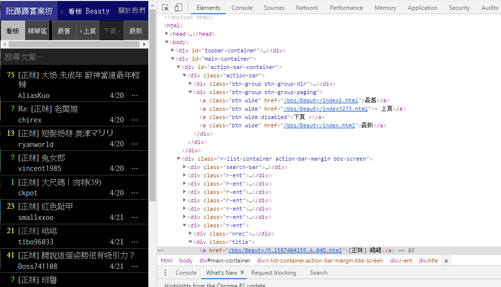
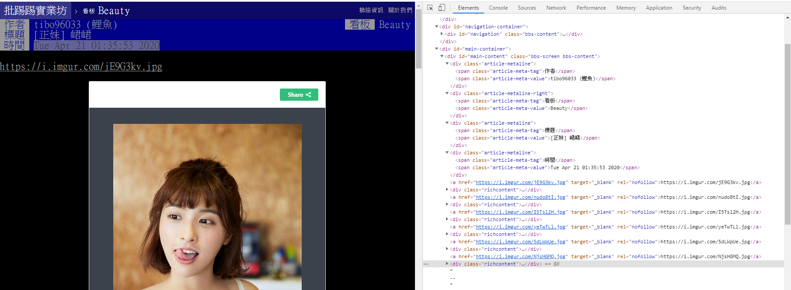

# PTT Spider


這是一個two direction 爬蟲，我們抓文章照片和標題

## 抓取page pre
</img>

```html
<div class="btn-group btn-group-paging">
	<a class="btn wide" href="/bbs/Beauty/index1.html">最舊</a>
	<a class="btn wide" href="/bbs/Beauty/index3272.html">‹ 上頁</a>
	<a class="btn wide disabled">下頁 ›</a>
	<a class="btn wide" href="/bbs/Beauty/index.html">最新</a>
</div>
```

以css為例
```python
>>> response.css('a.wide').extract()[1]
'<a class="btn wide" href="/bbs/Baseball/index10010.html">‹ 上頁</a>'
```
## data link

```html
<div class="r-ent">
	...
		<div class="title">			
		<a href="/bbs/Baseball/M.1587361494.A.196.html">[討論] 被攻佔滿壘時給投手喘息的方法哪個最好</a>			
	</div>
	....
</div>
```

```python
response.css('div.title a')
```

## extract data 
</img>
以這篇為例https://www.ptt.cc/bbs/Baseball/M.1587361494.A.196.html


假設我們想抓標題,日期,作者,內容,圖像
這邊分別可以得到,標題,日期,作者
```python
>>> response.css("span.article-meta-value::text").extract()
['Timekeeper (fine)', 'Baseball', '[討論] 被攻佔滿壘時給投手喘息的方法哪個最好', 'Mon Apr 20 13:44:52 2020']
```    
    
```python
>>> response.css("#main-content::text").extract()
['\n棒球場上最緊張刺激的時刻之一\n就是被攻佔滿壘的時候\n對於進攻方而言是個一舉得分的絕佳機會\n對於防守方來說要守住滿壘的壓力肯定很大\n\n這時候常見有幾個方法給緊張的投手喘息的時間\n\n1.捕手走上投手丘講
幾句話\n這個方法個人覺得不太好，因為通常不到30秒就會被主審打斷\n\n2.投手教練上丘講話\n常常看到投手教練上去安撫投手，緩和投手的壓力\n但這方法通常也不會超過1分鐘\n\n\n還有什麼方法是可以拖更長的時間\n讓
被攻佔滿壘，皮皮挫的投手有更多喘息時間的嗎？\n\n\n--\n', '我不是邦迷也不是吱迷喔\n']
>>>
```

## code
```python
class PTT_spider(scrapy.Spider):
    name = 'ptt'
    allowed_domains = ['ptt.cc']   
    page = 0
    
    def start_requests(self):
        
        board = getattr(self, 'board', None)
        if tag is not None:
            url = 'https://www.ptt.cc/bbs/%s/index.html' %board
            yield scrapy.Request(url, self.parse)        
   
    def parse(self, response):
        # follow links to article pages
        self.page += 1      
        print (response.url)
        yield from response.follow_all(css = 'div.title a', callback = self.parse_article)               
        if self.page <= 1:
            yield response.follow(response.css('a.wide')[1], self.parse)        
   

    def parse_article(self, response):
        print (response.url)
        author,name,title,date_time = response.css("span.article-meta-value::text").extract()
        content = response.css("#main-content::text").extract()

        yield {
            'author': author,
            'title': title,
            'date_time': date_time,
            'content':content,
        }      
```       

## How to get Imange with Beauty
因為要存圖檔的關係,再pipelines.py 新增
```

def create_folder(path):
    if not os.path.exists(path):
        os.makedirs(path)
        
from scrapy.pipelines.images import ImagesPipeline
class DownLoad(ImagesPipeline):

    def get_media_requests(self, item, info):
        save_path = "D:\\crawl\\%s\\{0}\\{1}".(item['board'],%item['title']) 
        create_folder(save_path)        

        for image_url in item['image_urls']:	
            urllib.urlretrieve(image_url,savepath+'\\%s.jpg' %Count)
            Count+=1
        
    def item_completed(self, results, item, info):
        image_paths = [x['path'] for ok, x in results if ok]    
        if not image_paths:
            raise DropItem("Item contains no images")        
        return item	     

```

```
scrapy crawl ptt -o 888.csv -a tag="Beauty"
```

 
  


