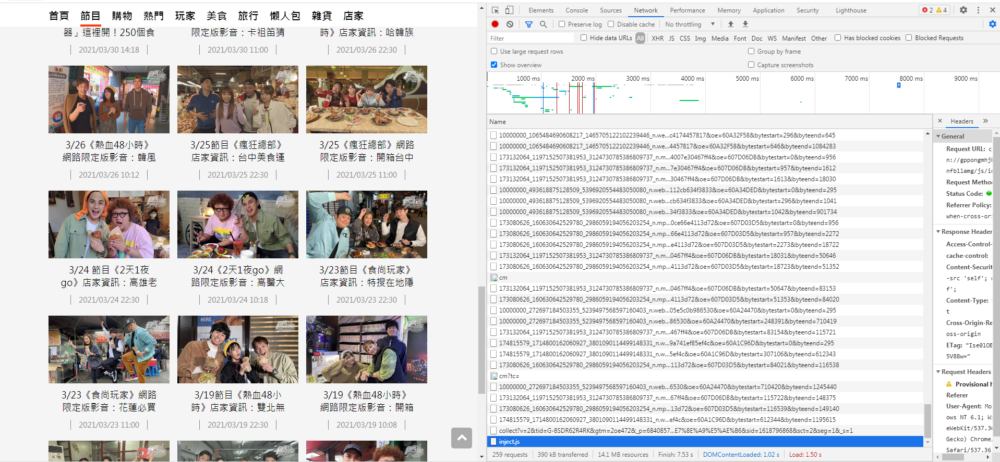
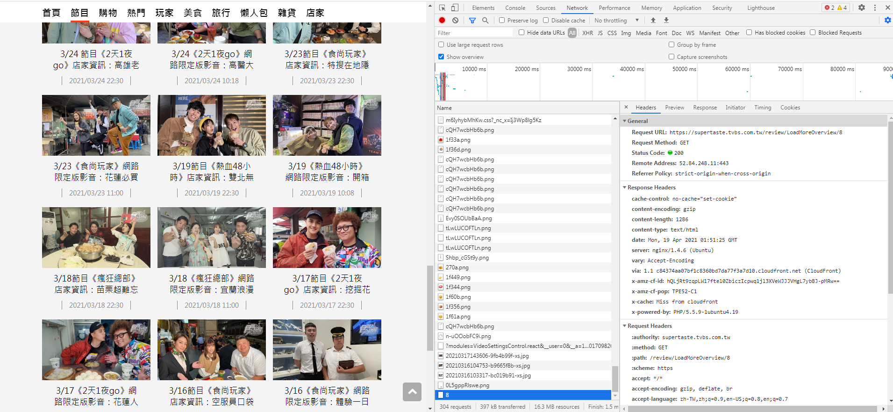
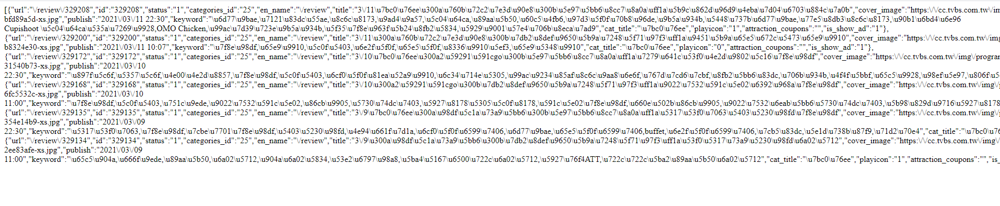
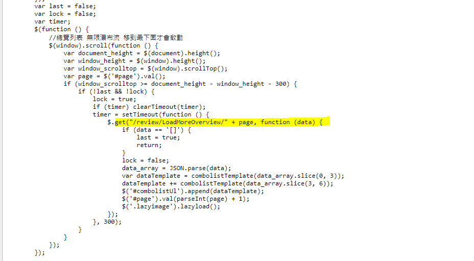

# 爬取Infinite Scroll

這邊以爬取<a href = "https://supertaste.tvbs.com.tw/review">食尚玩家</a>網站為例,點進去可以發現,當網頁滾動到底部時,網頁會自動產生資料,

## 如何取得下一頁 
這種方式通常是透過ajax 取得資料,所以要取得ajax 透過哪個網頁來取得資料的,按F12 打開network那頁,並且重新整理,network會跑出很多,那個就是載入網頁是會讀取的檔案或是資料



接著往下滑到底部,讓它產生新的項目,並檢查network新增的出來的項目,去找尋取得資料的網址,可以發現如下




接著連進去https://supertaste.tvbs.com.tw/review/LoadMoreOverview/8 ,可以發現網頁內容是json格式,有明顯url的keyword,就是我們想要的




其實可以在網頁原始碼發現,可以發現是藉由觸發事件在去/review/LoadMoreOverview/page觸發,但是一般來說這部分的js 可能寫在外部js檔,比較難發現,還是建議用上面的方法



## code
```python
import scrapy
import json

class SupertasteSpider(scrapy.Spider):
    name = 'supertaste'
    def start_requests(self):       
        for page in range(1,66):
            url = "https://supertaste.tvbs.com.tw/review/LoadMoreOverview/%s" %page
            yield scrapy.Request(url)    

    def parse(self, response): 
        datas = json.loads(response.body.decode('utf-8'))   
        detail_links = [data['url'] for data in datas]     
        yield from response.follow_all(detail_links, self.parse_detail)
        
        
    def get_array_data(self,array):      
        return array[0] if array else ""
    
    def parse_detail(self, response):  
        show_name = self.get_array_data(response.css('div.newsdetail_content div.title h1::text').re(r'.*?《(.*?)》'))          
        
        date =  self.get_array_data(response.css('div.icon_time::text').re(r'(\d+/\d+/\d+).*'))   
        if show_name:     
            for store in response.css('div.store_div'):
                image_url = store.css('img.lazyimage::attr(data-original)').get()
                name = store.css('div.store_info h2::text').get()           
                address = self.get_array_data(store.css('div.store_info p::text').re(r'地址：(.*)'))
                business_hours = self.get_array_data(store.css('div.store_info p::text').re(r'時間：(.*)'))
                telephone = self.get_array_data(store.css('div.store_info p::text').re(r'電話：(.*)'))                               
                yield {                    
                    'date' : date,
                    'show_name' :  show_name,
                    'url':response.url,
                    'name' :  name,
                    'image_url' : image_url,
                    'address' : address,
                    'business_hours' :  business_hours,          
                    'telephone' :  telephone,
                    #'points' : points
                }
```


  


