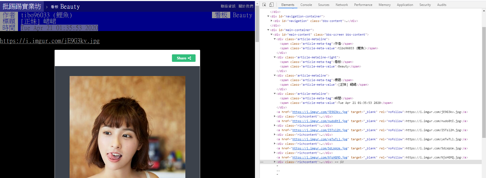

# PTT Spider


## Beauty


### 抓取Link
這是一個雙向爬蟲,需要界面的下一頁,和每頁每個文章的Link

</img>
首先抓取下一頁的連結

```html
<div class="btn-group btn-group-paging">
	<a class="btn wide" href="/bbs/Beauty/index1.html">最舊</a>
	<a class="btn wide" href="/bbs/Beauty/index3272.html">‹ 上頁</a>
	<a class="btn wide disabled">下頁 ›</a>
	<a class="btn wide" href="/bbs/Beauty/index.html">最新</a>
</div>
```

從這邊來看只需要抓取tag 為a,class 為wide底下第2個link


使用scrapy shell 來測試,因為進去網頁會跳出是否滿18,所以直接使用scrapy shell
```
url = 'https://www.ptt.cc/bbs/Beauty/index.html'
cookies = {"over18": "1"}
response = scrapy.Request(url, cookies=cookies)
fetch(response)
```
下完後就可以來測試,以css為例
```python
>>> response.css('a.wide').extract()[1]
'<a class="btn wide" href="/bbs/Baseball/index10010.html">‹ 上頁</a>'
```

抓取文章連結

```html
<div class="r-ent">
	...
	<div class="title">			
		<a href="/bbs/Beauty/M.1587404155.A.04D.html">[正妹] 峮峮</a>			
	</div>
	....
</div>
```
這邊只要抓<div class="title">底下a的連結
```python
    response.css('div.title a')
```

### extract data 
</img>

一樣在shell 底下
```python
url = 'https://www.ptt.cc/bbs/Beauty/M.1587404155.A.04D.html'
cookies = {"over18": "1"}
response = scrapy.Request(url, cookies=cookies)
fetch(response)
```

由上圖可以發現只要抓<span clsss="article-meta-value">的值就可以把資訊抓起來
```python
>>> response.css("span.article-meta-value::text").extract()
['tibo96033 (鯉魚)', 'Beauty', '[正妹] 峮峮', 'Tue Apr 21 01:35:53 2020']
```    

get image url
```html
	<div id="main-content" class="bbs-screen bbs-content">
		<a href="https://i.imgur.com/jE9G3kv.jpg" target="_blank" rel="nofollow">https://i.imgur.com/jE9G3kv.jpg</a>
        <div class="richcontent">
            <blockquote class="imgur-embed-pub" lang="en" data-id="jE9G3kv">
                <a href="//imgur.com/jE9G3kv"></a>
            </blockquote>
            <script async src="//s.imgur.com/min/embed.js" charset="utf-8"></script>
		</div>
        
		<a href="https://i.imgur.com/nudo8tI.jpg" target="_blank" rel="nofollow">https://i.imgur.com/nudo8tI.jpg</a>
			<div class="richcontent">
				<blockquote class="imgur-embed-pub" lang="en" data-id="nudo8tI">
                    <a href="//imgur.com/nudo8tI"></a>
				</blockquote>
				<script async src="//s.imgur.com/min/embed.js" charset="utf-8"></script>
			</div>
        .....
    </div>    
```
這邊我們抓div.richcontent blockquote.imgur-embed-pub 底下的連結

```python
>>> response.css("div.richcontent blockquote a::attr(href)").extract()
['//imgur.com/jE9G3kv', '//imgur.com/nudo8tI', '//imgur.com/I5Tsl2H', '//imgur.com/yeTwTLl', '//imgur.com/5dLWpUe', '//imgur.com/NjsHGMQ', '//imgur.com/jZqQT4A']
```
或者使用
```python
>>> response.xpath('//div[contains(@class,"bbs-screen")]//a[contains(@href, ".jpg")]/@href').extract()
['https//i.imgur.com/jE9G3kv.jpg', 'https//i.imgur.com/nudo8tI.jpg', 'https//i.//imgur.com/I5Tsl2H.jpg',...
```

直接抓取jpg的話不用就轉換,後來發現並非所有都含有jpg,使用response.css("div.richcontent blockquote a::attr(href)").extract()比較保險
所以在pipelines.py 新增轉換網址

```python
def imgur_link_to_url(link):    
    import re
    match = re.match('^//imgur.com/([a-zA-Z0-9]+)',link)
    if match:
        return "https://i.imgur.com/" + match.group(1) + ".jpg"
    else:
        return link    

class ImgurPipeline:
    def process_item(self, item, spider):
        if 'image_urls' in item:
            item['image_urls'] = list(map(imgur_link_to_url, item['image_urls']))
        return item
```


### DownLoad Image
在setting.py 
ITEM_PIPELINES = {'scrapy.pipelines.images.ImagesPipeline': 1}
IMAGES_STORE = 'images'

即可下載圖片,如果需要自訂資料夾和名字可以在pipelines撰寫,參考pipelines文章


### spider

#### Spider

使用ITEM_PIPELINES = {'scrapy.pipelines.images.ImagesPipeline': 1}需要使用Items寫法

```python
from example.items import PttItem
class BeautySpiderItem(scrapy.Spider):
    name = 'beauty_item'
    allowed_domains = ['ptt.cc']  
    page = 0
    max_page = 2 
    custom_settings = {'ITEM_PIPELINES': {'example.pipelines.ImgurPipeline': 3}        
    
    def start_requests(self):  
        url = 'https://www.ptt.cc/bbs/Beauty/index.html' 
        yield scrapy.Request(url, cookies ={'over18': '1'},callback = self.parse)        

    def parse(self, response):    
        self.page += 1    
        
        for link in response.css('div.title a'):            
            if '[正妹]' in link.css('::text').get():                
                yield response.follow(link, callback = self.parse_article)          
        
        if self.page <= self.max_page:
            yield response.follow(response.css('a.wide')[1], self.parse)        
   

    def parse_article(self, response):        
        author,board,title,date_time = response.css("span.article-meta-value::text").extract()        
        content = response.css("#main-content::text").extract()
        #image_urls = response.xpath('//div[contains(@class,"bbs-screen")]//a[contains(@href, ".jpg")]/@href').extract()
        img_urls = response.css('div.richcontent blockquote.imgur-embed-pub a::attr(href)').extract()
        
        item = PttItem()        
        item['board'] = board
        item['author'] = author
        item['title'] = title
        item['date_time'] = date_time
        item['content'] = content
        item['image_urls'] = image_urls
       
        yield item    
```       


#### CrawlSpider

使用自訂的就不需要寫items
```python
import scrapy
from scrapy.spiders import CrawlSpider,Rule
from scrapy.linkextractors import LinkExtractor

class BeautyCrawlSpider(CrawlSpider):
    name = 'ptt_beauty'
    allowed_domains = ['ptt.cc']      
    custom_settings = {'ITEM_PIPELINES': {'example.pipelines.PttImageDownLoad': 800,}}        
    def start_requests(self):       
        url = 'https://www.ptt.cc/bbs/Beauty/index.html' 
        yield scrapy.Request(url, cookies ={'over18': '1'})    
       
    rules = ( 
        Rule(LinkExtractor(restrict_css ='a.wide ')),
        Rule(LinkExtractor(restrict_css='div.title a',restrict_text = r'\[正妹\].*'), callback ='parse_beauty'),
    )  
    
    def parse_beauty(self, response):          
        author,board,title,date_time = response.css("span.article-meta-value::text").extract()    
        image_urls = response.xpath('//div[contains(@class,"bbs-screen")]//a[contains(@href, ".jpg")]/@href').extract()
        yield {  
            'board':board,
            'title': title,    
            'link': response.url,
            'image_urls':image_urls
        }
```


  


