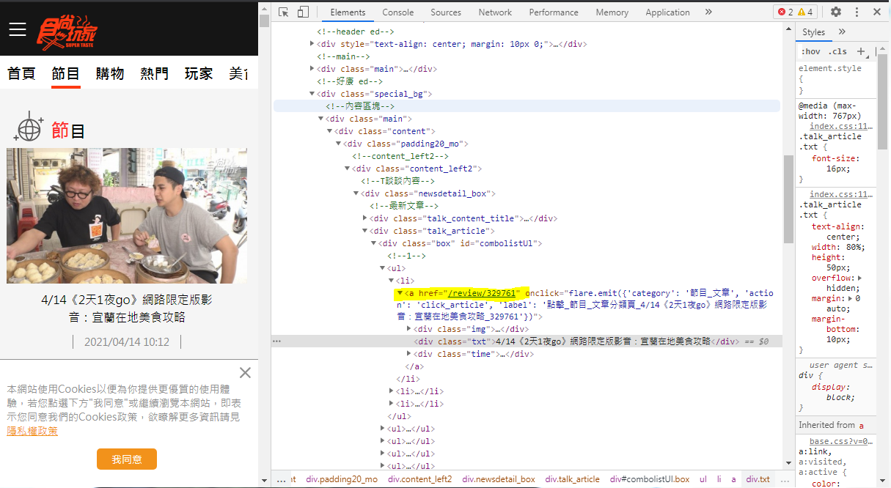
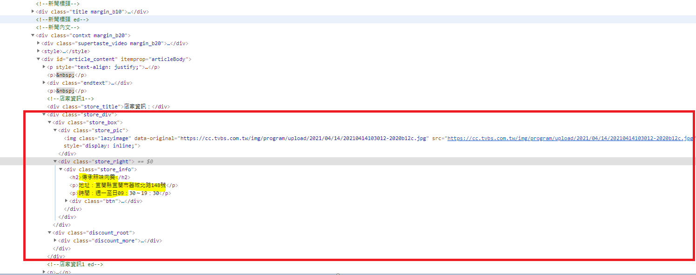
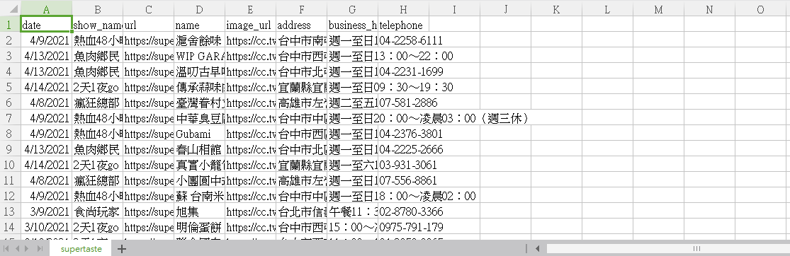

# 爬取食尚玩家

<a href = "https://supertaste.tvbs.com.tw/review">食尚玩家</a>網址,想要爬取每個連結裡面的內容,這個是雙向爬蟲

可以先參考<a href ="https://github.com/Eddie02582/Scrapy/tree/master/%5BScrapy%20%E6%95%99%E5%AD%B85%5D%E9%9B%99%E5%90%91%E7%88%AC%E8%9F%B2">[Scrapy 教學5]雙向爬蟲</a>


## 取得內部連結和資料

我們想取得連結,可以從div class ="box"底下ul li a取得




從連結取得資料



```python
    image_url = store.css('img.lazyimage::attr(data-original)').get()
    name = store.css('div.store_info h2::text').get()           
    address = self.get_array_data(store.css('div.store_info p::text').re(r'地址：(.*)'))
    business_hours = self.get_array_data(store.css('div.store_info p::text').re(r'時間：(.*)'))
    telephone = self.get_array_data(store.css('div.store_info p::text').re(r'電話：(.*)'))  
```


code

```python
import scrapy

class SupertasteSpider(scrapy.Spider):
    name = 'supertaste'
    start_urls = ['https://supertaste.tvbs.com.tw/review/']

    def parse(self, response):
        detail_links = response.css('div.box ul li a')        
        yield from response.follow_all(detail_links, self.parse_detail)
        
    def get_array_data(self,array):      
        return array[0] if array else ""
    
    def parse_detail(self, response):  
        date,show_name = response.css('div.newsdetail_content div.title h1::text').re(r'(\d+/\d+).*?《(.*?)》')           
        
        for store in response.css('div.store_div'):
            image_url = store.css('img.lazyimage::attr(data-original)').get()
            name = store.css('div.store_info h2::text').get()           
            address = self.get_array_data(store.css('div.store_info p::text').re(r'地址：(.*)'))
            business_hours = self.get_array_data(store.css('div.store_info p::text').re(r'時間：(.*)'))
            telephone = self.get_array_data(store.css('div.store_info p::text').re(r'電話：(.*)'))  
            if '食尚玩家購物網' in name:
                continue
            
            yield {
                'date' : date,
                'show_name' :  show_name,
                'name' :  name,
                'image_url' : image_url,
                'address' : address,
                'business_hours' :  business_hours,          
                'telephone' :  telephone,
               
            }
            
```

## 取得下一頁的資料
可以發現,當網頁滾動到底部時,網頁會自動產生資料,推測可能是使用ajax取得資料,所以需要改寫前面取得網頁的方式,參考<a href = "https://github.com/Eddie02582/Scrapy/tree/master/%5BScrapy%20%E6%95%99%E5%AD%B86%5D%E7%88%AC%E5%8F%96%E5%8B%95%E6%85%8B%E7%B6%B2%E9%A0%81%20I(Ajax)">[Scrapy 教學6]爬取動態網頁 I (Ajax)</a>
這邊強烈建議先找網頁下一頁的方法,以免白做工

```python
import scrapy
import json    

class SupertasteSpider(scrapy.Spider):
    name = 'supertaste'
    def start_requests(self):       
        for page in range(1,66):
            url = "https://supertaste.tvbs.com.tw/review/LoadMoreOverview/%s" %page
            yield scrapy.Request(url)    

    def parse(self, response): 
        datas = json.loads(response.body.decode('utf-8'))      
        detail_links = [data['url'] for data in datas]     
        yield from response.follow_all(detail_links, self.parse_detail)
        
        
    def get_array_data(self,array):      
        return array[0] if array else ""
    
    def parse_detail(self, response):  
        show_name = self.get_array_data(response.css('div.newsdetail_content div.title h1::text').re(r'.*?《(.*?)》'))          
        
        date =  self.get_array_data(response.css('div.icon_time::text').re(r'(\d+/\d+/\d+).*'))   
        if show_name:     
            for store in response.css('div.store_div'):
                image_url = store.css('img.lazyimage::attr(data-original)').get()
                name = store.css('div.store_info h2::text').get()           
                address = self.get_array_data(store.css('div.store_info p::text').re(r'地址：(.*)'))
                business_hours = self.get_array_data(store.css('div.store_info p::text').re(r'時間：(.*)'))
                telephone = self.get_array_data(store.css('div.store_info p::text').re(r'電話：(.*)'))  
                if '食尚玩家購物網' in name:
                    continue
                
                yield {                    
                    'date' : date,
                    'show_name' :  show_name,
                    'url':response.url,
                    'name' :  name,
                    'image_url' : image_url,
                    'address' : address,
                    'business_hours' :  business_hours,          
                    'telephone' :  telephone,                  
                }
```

結果
