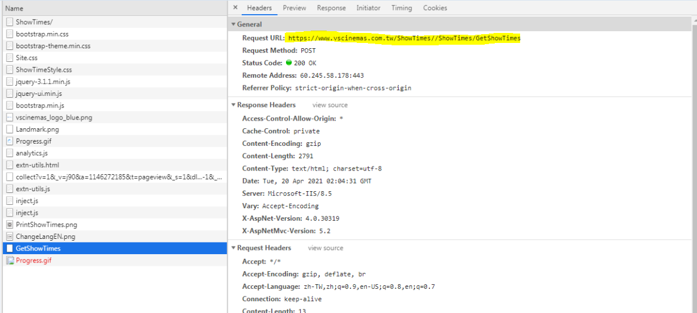
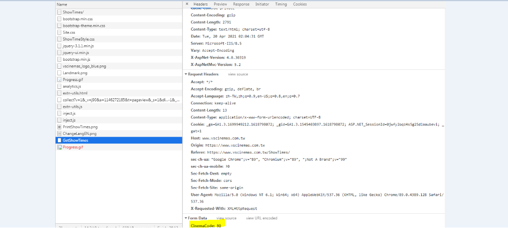

# POST Request

https://www.vscinemas.com.tw/ShowTimes/

</img>

選擇信義威秀,可以發現網址沒變但是內容變了

</img>

重新回到https://www.vscinemas.com.tw/ShowTimes/

開啟F12,Network部分,再次選擇信義威秀,可以發現Network底下多了一些項目,檢查GetshowTimes,可以發現是對https://www.vscinemas.com.tw/ShowTimes//ShowTimes/GetShowTimes請求


</img>

在往下看對網頁提出form data的資料

</img>


```python 
import scrapy
class ViewshowSpider(scrapy.Spider):
    name = 'viewshow'
    allowed_domains = ['www.vscinemas.com.tw/']
  

    def start_requests(self):    
        url = 'https://www.vscinemas.com.tw/ShowTimes//ShowTimes/GetShowTimes'  
        yield scrapy.FormRequest(url,self.parse,formdata={'CinemaCode':'TP'})
        
    
    def parse(self, response):
        print (response.body)
```
可以發現資料有出來了,剩下就是一般爬蟲的處理
</img>


結果如下
</img>